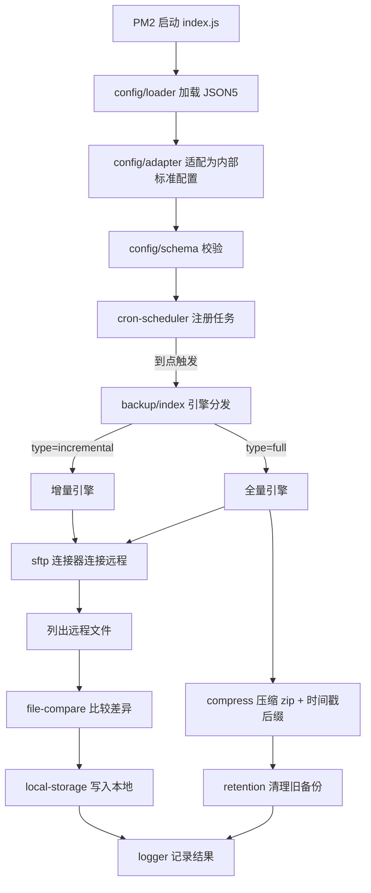

# 自动备份工具设计文档

> 技术栈：Node.js + JSON5 配置 + node-cron 调度 + PM2 常驻
> 功能：从远程服务器（SFTP）自动拉取文件，支持**增量备份**与**全量备份**两种模式

---

## 一、需求梳理

| 需求 | 说明 |
|------|------|
| 拉取来源 | 仅支持 **SFTP** 下载 |
| 配置文件 | 使用 **JSON5**（支持注释、尾逗号、单引号，便于人工维护） |
| 调度 | 使用 **cron** 表达式设置任务执行时间 |
| 常驻运行 | 使用 **PM2** 启动，保证进程稳定、崩溃自动重启 |
| 增量备份 | 通过 **文件名称、文件大小、修改日期** 简单判断是否需要同步 |
| 全量备份 | 目标目录/文件追加 **`_时间戳`** 后缀区分版本；可配置**最大保留份数**，超出自动删除最老备份 |
| 认证方式 | **自动判断**：配置了 `password` 用密码认证，配置了 `privateKeyPath` 用私钥认证 |
| 压缩格式 | 统一使用 **zip** |
| 过滤规则 | 增量备份中 **include 优先于 exclude** |

---

## 二、配置文件结构（JSON5）

配置文件建议放在 `config/backup.config.json5`。

**本次调整的核心变化**：
1. `tasks` 字段**内嵌到每个 `servers` 中**，任务不再需要 `server` 引用和 `id`。
2. 只保留 **sftp** 一种连接类型。
3. 认证方式**自动判断**，无需手动指定 `type`。
4. 连接与重试参数**可省略**，省略时使用默认值。
5. 压缩统一为 **zip**。
6. 增量备份 **include 优先于 exclude**。

```json5
{
  // ============ 全局配置 ============
  log: {
    level: "info",            // debug | info | warn | error
    dir: "./logs",            // 日志目录
    maxFiles: 30,             // 日志文件保留数量
    maxSize: "10m",           // 单个日志文件大小
  },

  // ============ 服务器（可多个，每个内含自己的备份任务） ============
  servers: [
    {
      // ---- 连接信息 ----
      host: "192.168.1.100",        // 必填
      port: 22,                     // 可选，默认 22
      username: "root",             // 必填

      // ---- 认证（自动判断，二选一即可） ----
      password: "your-password",    // 有此项 → 密码认证
      // privateKeyPath: "~/.ssh/id_rsa", // 有此项 → 私钥认证
      // passphrase: "xxx",         // 私钥口令（可选，仅私钥认证时用）

      // ---- 连接与重试（可选，省略用默认值） ----
      // connectTimeout: 10000,     // 默认 10000ms
      // retry: { max: 3, delay: 5000 }, // 默认 { max: 3, delay: 5000 }

      // ---- 该服务器下的备份任务（可多个） ----
      tasks: [
        // ---------- 增量备份 ----------
        {
          name: "MySQL 数据增量备份",
          enabled: true,
          type: "incremental",      // incremental | full
          cron: "0 2 * * *",        // 每天凌晨 2 点
          source: "/data/mysql/backup", // 远程源路径
          destination: "./backups/mysql", // 本地目标路径

          incremental: {
            compareBy: ["name", "size", "mtime"], // 比较依据
            deleteRemoved: false,   // 远程已删除的文件，本地是否同步删除
            include: ["**/*.sql"],  // 仅包含规则（优先于 exclude）
            exclude: ["*.tmp", "*.log"], // 排除规则
            concurrency: 4,         // 并发下载数
          },
        },

        // ---------- 全量备份 ----------
        {
          name: "Nginx 配置全量备份",
          enabled: true,
          type: "full",
          cron: "0 3 * * 0",        // 每周日凌晨 3 点
          source: "/etc/nginx",
          destination: "./backups/nginx",

          full: {
            maxBackups: 5,          // 最多保留 5 份，超出删除最老的
            timestampFormat: "YYYYMMDD-HHmmss", // 时间戳后缀格式
            compress: true,         // 是否压缩为 zip
            exclude: ["*.log"],
          },
        },
      ],
    },
    // 可继续添加第二个服务器...
  ],
}
```

### 配置要点说明

- **服务器与任务合并**：每个服务器下直接挂 `tasks`，任务天然属于该服务器，无需 `server` 引用和 `id`。
- **认证自动判断**：`password` 存在 → 密码认证；`privateKeyPath` 存在 → 私钥认证；两者都无 → 启动时报错。
- **默认值**：`port`、`connectTimeout`、`retry` 均可省略，程序自动填充默认值。
- **include 优先于 exclude**：增量备份中，先按 `include` 过滤（只处理匹配的文件），再在匹配结果中应用 `exclude`。若 `include` 为空则处理全部文件。

---

## 三、配置适配器（Adapter）

为了让用户配置保持**简洁直观**，同时让程序内部使用**规范化结构**，程序启动时通过一个**适配器**将用户配置转换为内部标准结构。

### 3.1 为什么需要适配器

用户配置追求**极简**（省略默认值、自动判断认证），而程序内部需要**完整、明确**的数据结构（所有字段都有值、认证类型已确定）。适配器在启动时完成这一转换，职责单一、便于测试。

### 3.2 适配器职责


适配器主要做三件事：

1. **填充默认值**：`port`、`connectTimeout`、`retry`、`compareBy`、`maxBackups`、`compress` 等未配置时填入默认值。
2. **确定认证类型**：根据 `password` / `privateKeyPath` 是否存在，生成内部 `auth: { type: "password" | "privateKey", ... }` 结构。
3. **归一化过滤规则**：将 `include` / `exclude` 统一为数组，并标记 include 优先的语义。

### 3.3 适配器转换示例

**用户配置（输入）**：
```json5
{
  servers: [
    {
      host: "192.168.1.100",
      username: "root",
      password: "secret",
      tasks: [
        { name: "增量", type: "incremental", cron: "0 2 * * *",
          source: "/data", destination: "./b" },
      ],
    },
  ],
}
```

**内部标准配置（输出）**：
```js
{
  log: { level: "info", dir: "./logs", maxFiles: 30, maxSize: "10m" },
  servers: [
    {
      host: "192.168.1.100",
      port: 22,                          // 默认值
      username: "root",
      auth: { type: "password", password: "secret" }, // 自动判断
      connectTimeout: 10000,             // 默认值
      retry: { max: 3, delay: 5000 },    // 默认值
      tasks: [
        {
          name: "增量",
          enabled: true,                 // 默认值
          type: "incremental",
          cron: "0 2 * * *",
          source: "/data",
          destination: "./b",
          incremental: {
            compareBy: ["name", "size", "mtime"], // 默认值
            deleteRemoved: false,        // 默认值
            include: [],
            exclude: [],
            concurrency: 4,              // 默认值
          },
        },
      ],
    },
  ],
}
```

---

## 四、程序架构

### 4.1 目录结构

```
backup-tool/
├── package.json
├── ecosystem.config.js        # PM2 配置
├── config/
│   └── backup.config.json5    # 主配置文件（用户极简配置）
├── src/
│   ├── index.js               # 入口：加载配置 → 适配 → 校验 → 启动调度器
│   ├── config/
│   │   ├── loader.js          # 读取并解析 JSON5
│   │   ├── adapter.js         # 适配器：极简配置 → 内部标准配置
│   │   └── schema.js          # 配置校验（必填项、类型、枚举）
│   ├── scheduler/
│   │   └── cron-scheduler.js  # node-cron 调度器，注册/注销任务
│   ├── connectors/
│   │   ├── base.js            # 连接器抽象基类（统一接口）
│   │   └── sftp.js            # SFTP 连接器（ssh2-sftp-client）
│   ├── backup/
│   │   ├── index.js           # 引擎分发：根据 type 选择引擎
│   │   ├── incremental.js     # 增量备份引擎
│   │   └── full.js            # 全量备份引擎
│   ├── storage/
│   │   ├── local-storage.js   # 本地存储写入
│   │   └── retention.js       # 保留策略（全量备份清理旧版本）
│   ├── utils/
│   │   ├── logger.js          # 日志（winston）
│   │   ├── file-compare.js    # 文件比较（名称/大小/mtime）
│   │   ├── compress.js        # 压缩（zip）
│   │   └── path.js            # 路径与时间戳工具
│   └── errors.js              # 统一错误类型
├── logs/                      # 运行日志
└── backups/                   # 备份输出目录
```

### 4.2 模块职责与数据流



### 4.3 核心模块说明

#### ① 配置加载、适配与校验（`config/`）
- `loader.js`：用 `json5` 包读取配置文件，支持环境变量 `BACKUP_CONFIG` 指定路径。
- `adapter.js`：**核心新增模块**，将用户极简配置转换为内部标准配置（填充默认值、确定认证类型、归一化过滤规则）。
- `schema.js`：用 `zod` 校验适配后的配置，检查必填字段、类型、枚举值（`type` 只能是 `incremental`/`full`），配置错误时启动即报错退出。

#### ② 调度器（`scheduler/cron-scheduler.js`）
- 使用 `node-cron`，遍历所有服务器的 `tasks`，为每个 `enabled` 的任务注册 cron 任务。
- 每个任务执行时**串行**（同一任务不并发），防止上次未跑完又触发。
- 记录上次执行时间、状态，便于排查。

#### ③ 连接器（`connectors/`）
- 定义统一接口：`connect()` / `listFiles(path)` / `download(remote, local)` / `close()`。
- `sftp.js` 基于 `ssh2-sftp-client`，是唯一支持的连接类型。
- 认证方式由适配器确定的 `auth.type` 决定：密码或私钥。

#### ④ 增量备份引擎（`backup/incremental.js`）
- 列出远程目录文件 → 对每个文件按 `compareBy` 配置比较：
  - **name**：本地不存在同名文件 → 需要下载
  - **size**：大小不一致 → 需要下载
  - **mtime**：修改时间不一致 → 需要下载
- 只下载有差异的文件，实现增量同步。
- 可选 `deleteRemoved`：远程已删除的文件，本地同步删除（保持镜像）。
- **过滤规则**：`include` 优先于 `exclude` —— 先按 `include` 过滤（只处理匹配的文件），再在匹配结果中应用 `exclude`；`include` 为空则处理全部文件。

#### ⑤ 全量备份引擎（`backup/full.js`）
- 每次执行把整个 `source` 复制到 `destination/<name>_<时间戳>`。
- 时间戳格式由 `timestampFormat` 控制（如 `nginx_20260811-030000`）。
- 统一压缩为 **zip**（`compress: true` 时）。
- 完成后调用 `retention.js` 清理：按时间戳排序，保留最新的 `maxBackups` 份，删除更老的。

#### ⑥ 保留策略（`storage/retention.js`）
- 扫描目标目录下符合 `name_时间戳` 模式的备份。
- 按时间戳排序，超出 `maxBackups` 的部分删除（先删最老的）。
- 删除前记录日志，支持 `dryRun` 预览模式。

#### ⑦ 日志（`utils/logger.js`）
- 使用 `winston`，同时输出到控制台和文件（按天滚动）。
- 记录：任务开始/结束、下载文件数、失败项、清理的旧备份等。

### 4.4 PM2 配置（`ecosystem.config.js`）

```js
module.exports = {
  apps: [
    {
      name: "backup-tool",
      script: "src/index.js",
      instances: 1,                 // 单实例，避免重复备份
      exec_mode: "fork",
      autorestart: true,            // 崩溃自动重启
      max_memory_restart: "300M",   // 内存超限自动重启
      cron_restart: "0 4 * * *",    // 每天凌晨 4 点重启一次，防内存泄漏
      env: {
        NODE_ENV: "production",
        BACKUP_CONFIG: "./config/backup.config.json5",
      },
      out_file: "./logs/pm2-out.log",
      error_file: "./logs/pm2-error.log",
      merge_logs: true,
      time: true,
    },
  ],
};
```

### 4.5 依赖清单

| 依赖 | 用途 |
|------|------|
| `json5` | 解析 JSON5 配置 |
| `node-cron` | cron 调度 |
| `ssh2-sftp-client` | SFTP 拉取文件 |
| `winston` | 日志 |
| `zod` | 配置校验（可选） |
| `fast-glob` | 文件匹配 / include / exclude 规则 |
| `archiver` | 压缩打包（zip） |
| `dayjs` | 时间戳格式化 |

---

## 五、全量配置说明（所有字段）

> 以下为**完整字段清单**，标注了必填/可选、类型、默认值及说明。实际使用时可按需省略可选字段。

### 5.1 顶层 `log`（可选）

| 字段 | 类型 | 默认值 | 说明 |
|------|------|--------|------|
| `level` | string | `"info"` | 日志级别：`debug`/`info`/`warn`/`error` |
| `dir` | string | `"./logs"` | 日志目录 |
| `maxFiles` | number | `30` | 日志文件保留数量 |
| `maxSize` | string | `"10m"` | 单个日志文件大小 |

### 5.2 服务器 `servers[]`（必填）

| 字段 | 类型 | 必填 | 默认值 | 说明 |
|------|------|------|--------|------|
| `host` | string | ✅ | - | SFTP 服务器地址 |
| `port` | number | - | `22` | 端口 |
| `username` | string | ✅ | - | 用户名 |
| `password` | string | 二选一 | - | 密码认证（有此项则用密码） |
| `privateKeyPath` | string | 二选一 | - | 私钥路径（有此项则用私钥） |
| `passphrase` | string | - | - | 私钥口令（仅私钥认证时） |
| `connectTimeout` | number | - | `10000` | 连接超时 ms |
| `retry.max` | number | - | `3` | 失败重试次数 |
| `retry.delay` | number | - | `5000` | 重试间隔 ms |
| `tasks` | array | ✅ | - | 该服务器下的备份任务 |

> 认证判断：`password` 存在 → 密码认证；`privateKeyPath` 存在 → 私钥认证；两者都无 → 启动报错。

### 5.3 任务 `tasks[]`（必填）

| 字段 | 类型 | 必填 | 默认值 | 说明 |
|------|------|------|--------|------|
| `name` | string | ✅ | - | 任务名称（用于日志与全量备份目录名） |
| `enabled` | boolean | - | `true` | 是否启用 |
| `type` | string | ✅ | - | `incremental` / `full` |
| `cron` | string | ✅ | - | cron 表达式（分 时 日 月 周） |
| `source` | string | ✅ | - | 远程源路径 |
| `destination` | string | ✅ | - | 本地目标路径 |

### 5.4 增量任务 `incremental`（type=incremental 时）

| 字段 | 类型 | 必填 | 默认值 | 说明 |
|------|------|------|--------|------|
| `compareBy` | array | - | `["name","size","mtime"]` | 比较依据 |
| `deleteRemoved` | boolean | - | `false` | 远程删除的文件本地是否同步删除 |
| `include` | array | - | `[]` | 仅包含规则（**优先于 exclude**） |
| `exclude` | array | - | `[]` | 排除规则 |
| `concurrency` | number | - | `4` | 并发下载数 |

### 5.5 全量任务 `full`（type=full 时）

| 字段 | 类型 | 必填 | 默认值 | 说明 |
|------|------|------|--------|------|
| `maxBackups` | number | - | `5` | 最多保留份数，超出删除最老的 |
| `timestampFormat` | string | - | `"YYYYMMDD-HHmmss"` | 时间戳后缀格式 |
| `compress` | boolean | - | `true` | 是否压缩为 zip |
| `exclude` | array | - | `[]` | 排除规则 |

---

## 六、最简配置模板

> 只填必填项，其余全部用默认值。复制即可用。

### 6.1 最简：单个服务器 + 单个增量备份

```json5
{
  servers: [
    {
      host: "192.168.1.100",
      username: "root",
      password: "your-password",
      tasks: [
        {
          name: "数据增量备份",
          type: "incremental",
          cron: "0 2 * * *",
          source: "/data",
          destination: "./backups/data",
        },
      ],
    },
  ],
}
```

### 6.2 最简：单个服务器 + 单个全量备份

```json5
{
  servers: [
    {
      host: "192.168.1.100",
      username: "root",
      privateKeyPath: "~/.ssh/id_rsa",
      tasks: [
        {
          name: "配置全量备份",
          type: "full",
          cron: "0 3 * * 0",
          source: "/etc/nginx",
          destination: "./backups/nginx",
        },
      ],
    },
  ],
}
```

### 6.3 最简：私钥认证 + 多任务混合

```json5
{
  servers: [
    {
      host: "192.168.1.100",
      username: "root",
      privateKeyPath: "~/.ssh/id_rsa",
      passphrase: "my-passphrase",
      tasks: [
        { name: "增量", type: "incremental", cron: "0 2 * * *",
          source: "/data", destination: "./backups/data" },
        { name: "全量", type: "full", cron: "0 3 * * 0",
          source: "/etc", destination: "./backups/etc" },
      ],
    },
  ],
}
```

---

## 七、关键设计决策

1. **服务器与任务合并**：任务内嵌于服务器，天然归属，省去 `server` 引用和 `id`，配置更扁平直观。
2. **只支持 SFTP**：聚焦核心场景，连接器接口仍保留抽象，未来可扩展其他类型而不影响引擎。
3. **认证自动判断**：通过字段存在性判断认证类型，用户无需关心 `type`，减少配置错误。
4. **默认值机制**：连接、重试、备份策略等参数全部有默认值，用户只需配置必填项。
5. **适配器模式**：用户极简配置与程序内部标准配置解耦，适配器在启动时转换，职责单一、易测试、易扩展。
6. **include 优先于 exclude**：增量备份先按 include 过滤，再应用 exclude，语义清晰。
7. **统一 zip 压缩**：全量备份统一使用 zip，避免多格式带来的复杂度。
8. **PM2 单实例**：`instances: 1` 避免重复备份，`cron_restart` 每日重启防内存泄漏。

---

## 八、后续实施步骤（建议）

1. 初始化项目：`npm init` + 安装依赖
2. 实现 `config/loader.js`（JSON5 加载）
3. 实现 `config/adapter.js`（极简配置 → 内部标准配置，含默认值与认证判断）
4. 实现 `config/schema.js`（配置校验）
5. 实现 `connectors/sftp.js`（SFTP 连接器）
6. 实现 `backup/incremental.js` 与 `backup/full.js`
7. 实现 `storage/retention.js`（全量保留策略）
8. 实现 `scheduler/cron-scheduler.js`（接入 node-cron）
9. 实现 `utils/logger.js`（winston 日志）
10. 编写 `ecosystem.config.js`，用 PM2 启动验证
11. 接入真实 SFTP 服务器做端到端测试
